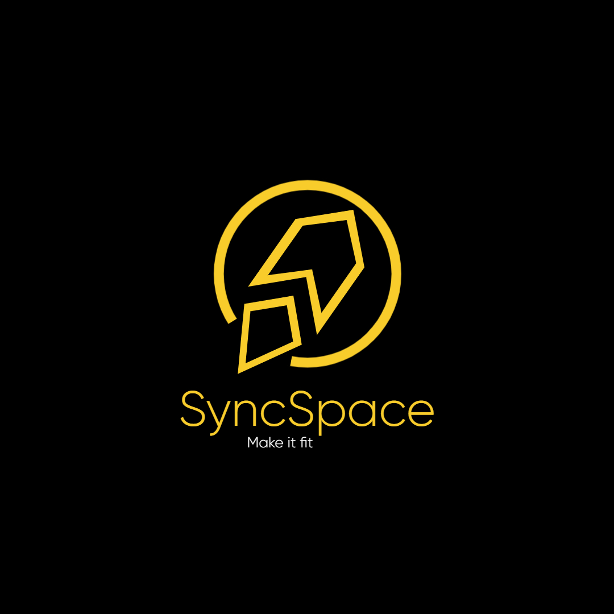

# 🏋️‍♂️ SyncSpace

  

**SyncSpace** es una aplicación móvil en desarrollo diseñada para gestionar turnos, suscripciones y actividades en gimnasios. Pensada para facilitar la experiencia tanto de los socios como del personal administrativo, permite organizar clases, registrar usuarios y administrar la asistencia a actividades como Crossfit, Yoga, Funcional y muchas más.

## 🎯 Objetivos

- Permitir a los miembros del gimnasio registrarse en clases disponibles (turnos).
- Gestionar suscripciones mediante vouchers con cantidad limitada de clases.
- Administrar múltiples actividades y sus respectivos cupos.
- Evitar sobrecupos en las clases y llevar un control claro de los registros.
- Proveer una experiencia simple, rápida y móvil para los usuarios.
